# Projects and dependencies analysis

This document provides a comprehensive overview of the projects and their dependencies in the context of upgrading to .NETCoreApp,Version=v10.0.

## Table of Contents

- [Executive Summary](#executive-Summary)
  - [Highlevel Metrics](#highlevel-metrics)
  - [Projects Compatibility](#projects-compatibility)
  - [Package Compatibility](#package-compatibility)
  - [API Compatibility](#api-compatibility)
- [Aggregate NuGet packages details](#aggregate-nuget-packages-details)
- [Top API Migration Challenges](#top-api-migration-challenges)
  - [Technologies and Features](#technologies-and-features)
  - [Most Frequent API Issues](#most-frequent-api-issues)
- [Projects Relationship Graph](#projects-relationship-graph)
- [Project Details](#project-details)

  - [src\Skoruba.IdentityServer4.Admin.Api\Skoruba.IdentityServer4.Admin.Api.csproj](#srcskorubaidentityserver4adminapiskorubaidentityserver4adminapicsproj)
  - [src\Skoruba.IdentityServer4.Admin.BusinessLogic.Identity\Skoruba.IdentityServer4.Admin.BusinessLogic.Identity.csproj](#srcskorubaidentityserver4adminbusinesslogicidentityskorubaidentityserver4adminbusinesslogicidentitycsproj)
  - [src\Skoruba.IdentityServer4.Admin.BusinessLogic.Shared\Skoruba.IdentityServer4.Admin.BusinessLogic.Shared.csproj](#srcskorubaidentityserver4adminbusinesslogicsharedskorubaidentityserver4adminbusinesslogicsharedcsproj)
  - [src\Skoruba.IdentityServer4.Admin.BusinessLogic\Skoruba.IdentityServer4.Admin.BusinessLogic.csproj](#srcskorubaidentityserver4adminbusinesslogicskorubaidentityserver4adminbusinesslogiccsproj)
  - [src\Skoruba.IdentityServer4.Admin.EntityFramework.Configuration\Skoruba.IdentityServer4.Admin.EntityFramework.Configuration.csproj](#srcskorubaidentityserver4adminentityframeworkconfigurationskorubaidentityserver4adminentityframeworkconfigurationcsproj)
  - [src\Skoruba.IdentityServer4.Admin.EntityFramework.Extensions\Skoruba.IdentityServer4.Admin.EntityFramework.Extensions.csproj](#srcskorubaidentityserver4adminentityframeworkextensionsskorubaidentityserver4adminentityframeworkextensionscsproj)
  - [src\Skoruba.IdentityServer4.Admin.EntityFramework.Identity\Skoruba.IdentityServer4.Admin.EntityFramework.Identity.csproj](#srcskorubaidentityserver4adminentityframeworkidentityskorubaidentityserver4adminentityframeworkidentitycsproj)
  - [src\Skoruba.IdentityServer4.Admin.EntityFramework.MySql\Skoruba.IdentityServer4.Admin.EntityFramework.MySql.csproj](#srcskorubaidentityserver4adminentityframeworkmysqlskorubaidentityserver4adminentityframeworkmysqlcsproj)
  - [src\Skoruba.IdentityServer4.Admin.EntityFramework.PostgreSQL\Skoruba.IdentityServer4.Admin.EntityFramework.PostgreSQL.csproj](#srcskorubaidentityserver4adminentityframeworkpostgresqlskorubaidentityserver4adminentityframeworkpostgresqlcsproj)
  - [src\Skoruba.IdentityServer4.Admin.EntityFramework.Shared\Skoruba.IdentityServer4.Admin.EntityFramework.Shared.csproj](#srcskorubaidentityserver4adminentityframeworksharedskorubaidentityserver4adminentityframeworksharedcsproj)
  - [src\Skoruba.IdentityServer4.Admin.EntityFramework.SqlServer\Skoruba.IdentityServer4.Admin.EntityFramework.SqlServer.csproj](#srcskorubaidentityserver4adminentityframeworksqlserverskorubaidentityserver4adminentityframeworksqlservercsproj)
  - [src\Skoruba.IdentityServer4.Admin.EntityFramework\Skoruba.IdentityServer4.Admin.EntityFramework.csproj](#srcskorubaidentityserver4adminentityframeworkskorubaidentityserver4adminentityframeworkcsproj)
  - [src\Skoruba.IdentityServer4.Admin.UI\Skoruba.IdentityServer4.Admin.UI.csproj](#srcskorubaidentityserver4adminuiskorubaidentityserver4adminuicsproj)
  - [src\Skoruba.IdentityServer4.Admin\Skoruba.IdentityServer4.Admin.csproj](#srcskorubaidentityserver4adminskorubaidentityserver4admincsproj)
  - [src\Skoruba.IdentityServer4.Shared.Configuration\Skoruba.IdentityServer4.Shared.Configuration.csproj](#srcskorubaidentityserver4sharedconfigurationskorubaidentityserver4sharedconfigurationcsproj)
  - [src\Skoruba.IdentityServer4.Shared\Skoruba.IdentityServer4.Shared.csproj](#srcskorubaidentityserver4sharedskorubaidentityserver4sharedcsproj)
  - [src\Skoruba.IdentityServer4.STS.Identity\Skoruba.IdentityServer4.STS.Identity.csproj](#srcskorubaidentityserver4stsidentityskorubaidentityserver4stsidentitycsproj)
  - [tests\Skoruba.IdentityServer4.Admin.Api.IntegrationTests\Skoruba.IdentityServer4.Admin.Api.IntegrationTests.csproj](#testsskorubaidentityserver4adminapiintegrationtestsskorubaidentityserver4adminapiintegrationtestscsproj)
  - [tests\Skoruba.IdentityServer4.Admin.IntegrationTests\Skoruba.IdentityServer4.Admin.IntegrationTests.csproj](#testsskorubaidentityserver4adminintegrationtestsskorubaidentityserver4adminintegrationtestscsproj)
  - [tests\Skoruba.IdentityServer4.Admin.UnitTests\Skoruba.IdentityServer4.Admin.UnitTests.csproj](#testsskorubaidentityserver4adminunittestsskorubaidentityserver4adminunittestscsproj)
  - [tests\Skoruba.IdentityServer4.STS.Identity.IntegrationTests\Skoruba.IdentityServer4.STS.Identity.IntegrationTests.csproj](#testsskorubaidentityserver4stsidentityintegrationtestsskorubaidentityserver4stsidentityintegrationtestscsproj)


## Executive Summary

### Highlevel Metrics

| Metric | Count | Status |
| :--- | :---: | :--- |
| Total Projects | 21 | 0 require upgrade |
| Total NuGet Packages | 59 | All compatible |
| Total Code Files | 796 |  |
| Total Code Files with Incidents | 0 |  |
| Total Lines of Code | 59192 |  |
| Total Number of Issues | 0 |  |
| Estimated LOC to modify | 0+ | at least 0,0% of codebase |

### Projects Compatibility

| Project | Target Framework | Difficulty | Package Issues | API Issues | Est. LOC Impact | Description |
| :--- | :---: | :---: | :---: | :---: | :---: | :--- |
| [src\Skoruba.IdentityServer4.Admin.Api\Skoruba.IdentityServer4.Admin.Api.csproj](#srcskorubaidentityserver4adminapiskorubaidentityserver4adminapicsproj) | net10.0 | ✅ None | 0 | 0 |  | AspNetCore, Sdk Style = True |
| [src\Skoruba.IdentityServer4.Admin.BusinessLogic.Identity\Skoruba.IdentityServer4.Admin.BusinessLogic.Identity.csproj](#srcskorubaidentityserver4adminbusinesslogicidentityskorubaidentityserver4adminbusinesslogicidentitycsproj) | net10.0 | ✅ None | 0 | 0 |  | ClassLibrary, Sdk Style = True |
| [src\Skoruba.IdentityServer4.Admin.BusinessLogic.Shared\Skoruba.IdentityServer4.Admin.BusinessLogic.Shared.csproj](#srcskorubaidentityserver4adminbusinesslogicsharedskorubaidentityserver4adminbusinesslogicsharedcsproj) | net10.0 | ✅ None | 0 | 0 |  | ClassLibrary, Sdk Style = True |
| [src\Skoruba.IdentityServer4.Admin.BusinessLogic\Skoruba.IdentityServer4.Admin.BusinessLogic.csproj](#srcskorubaidentityserver4adminbusinesslogicskorubaidentityserver4adminbusinesslogiccsproj) | net10.0 | ✅ None | 0 | 0 |  | ClassLibrary, Sdk Style = True |
| [src\Skoruba.IdentityServer4.Admin.EntityFramework.Configuration\Skoruba.IdentityServer4.Admin.EntityFramework.Configuration.csproj](#srcskorubaidentityserver4adminentityframeworkconfigurationskorubaidentityserver4adminentityframeworkconfigurationcsproj) | net10.0 | ✅ None | 0 | 0 |  | ClassLibrary, Sdk Style = True |
| [src\Skoruba.IdentityServer4.Admin.EntityFramework.Extensions\Skoruba.IdentityServer4.Admin.EntityFramework.Extensions.csproj](#srcskorubaidentityserver4adminentityframeworkextensionsskorubaidentityserver4adminentityframeworkextensionscsproj) | net10.0 | ✅ None | 0 | 0 |  | ClassLibrary, Sdk Style = True |
| [src\Skoruba.IdentityServer4.Admin.EntityFramework.Identity\Skoruba.IdentityServer4.Admin.EntityFramework.Identity.csproj](#srcskorubaidentityserver4adminentityframeworkidentityskorubaidentityserver4adminentityframeworkidentitycsproj) | net10.0 | ✅ None | 0 | 0 |  | ClassLibrary, Sdk Style = True |
| [src\Skoruba.IdentityServer4.Admin.EntityFramework.MySql\Skoruba.IdentityServer4.Admin.EntityFramework.MySql.csproj](#srcskorubaidentityserver4adminentityframeworkmysqlskorubaidentityserver4adminentityframeworkmysqlcsproj) | net10.0 | ✅ None | 0 | 0 |  | ClassLibrary, Sdk Style = True |
| [src\Skoruba.IdentityServer4.Admin.EntityFramework.PostgreSQL\Skoruba.IdentityServer4.Admin.EntityFramework.PostgreSQL.csproj](#srcskorubaidentityserver4adminentityframeworkpostgresqlskorubaidentityserver4adminentityframeworkpostgresqlcsproj) | net10.0 | ✅ None | 0 | 0 |  | ClassLibrary, Sdk Style = True |
| [src\Skoruba.IdentityServer4.Admin.EntityFramework.Shared\Skoruba.IdentityServer4.Admin.EntityFramework.Shared.csproj](#srcskorubaidentityserver4adminentityframeworksharedskorubaidentityserver4adminentityframeworksharedcsproj) | net10.0 | ✅ None | 0 | 0 |  | ClassLibrary, Sdk Style = True |
| [src\Skoruba.IdentityServer4.Admin.EntityFramework.SqlServer\Skoruba.IdentityServer4.Admin.EntityFramework.SqlServer.csproj](#srcskorubaidentityserver4adminentityframeworksqlserverskorubaidentityserver4adminentityframeworksqlservercsproj) | net10.0 | ✅ None | 0 | 0 |  | ClassLibrary, Sdk Style = True |
| [src\Skoruba.IdentityServer4.Admin.EntityFramework\Skoruba.IdentityServer4.Admin.EntityFramework.csproj](#srcskorubaidentityserver4adminentityframeworkskorubaidentityserver4adminentityframeworkcsproj) | net10.0 | ✅ None | 0 | 0 |  | ClassLibrary, Sdk Style = True |
| [src\Skoruba.IdentityServer4.Admin.UI\Skoruba.IdentityServer4.Admin.UI.csproj](#srcskorubaidentityserver4adminuiskorubaidentityserver4adminuicsproj) | net10.0 | ✅ None | 0 | 0 |  | ClassLibrary, Sdk Style = True |
| [src\Skoruba.IdentityServer4.Admin\Skoruba.IdentityServer4.Admin.csproj](#srcskorubaidentityserver4adminskorubaidentityserver4admincsproj) | net10.0 | ✅ None | 0 | 0 |  | AspNetCore, Sdk Style = True |
| [src\Skoruba.IdentityServer4.Shared.Configuration\Skoruba.IdentityServer4.Shared.Configuration.csproj](#srcskorubaidentityserver4sharedconfigurationskorubaidentityserver4sharedconfigurationcsproj) | net10.0 | ✅ None | 0 | 0 |  | ClassLibrary, Sdk Style = True |
| [src\Skoruba.IdentityServer4.Shared\Skoruba.IdentityServer4.Shared.csproj](#srcskorubaidentityserver4sharedskorubaidentityserver4sharedcsproj) | net10.0 | ✅ None | 0 | 0 |  | ClassLibrary, Sdk Style = True |
| [src\Skoruba.IdentityServer4.STS.Identity\Skoruba.IdentityServer4.STS.Identity.csproj](#srcskorubaidentityserver4stsidentityskorubaidentityserver4stsidentitycsproj) | net10.0 | ✅ None | 0 | 0 |  | AspNetCore, Sdk Style = True |
| [tests\Skoruba.IdentityServer4.Admin.Api.IntegrationTests\Skoruba.IdentityServer4.Admin.Api.IntegrationTests.csproj](#testsskorubaidentityserver4adminapiintegrationtestsskorubaidentityserver4adminapiintegrationtestscsproj) | net10.0 | ✅ None | 0 | 0 |  | DotNetCoreApp, Sdk Style = True |
| [tests\Skoruba.IdentityServer4.Admin.IntegrationTests\Skoruba.IdentityServer4.Admin.IntegrationTests.csproj](#testsskorubaidentityserver4adminintegrationtestsskorubaidentityserver4adminintegrationtestscsproj) | net10.0 | ✅ None | 0 | 0 |  | DotNetCoreApp, Sdk Style = True |
| [tests\Skoruba.IdentityServer4.Admin.UnitTests\Skoruba.IdentityServer4.Admin.UnitTests.csproj](#testsskorubaidentityserver4adminunittestsskorubaidentityserver4adminunittestscsproj) | net10.0 | ✅ None | 0 | 0 |  | DotNetCoreApp, Sdk Style = True |
| [tests\Skoruba.IdentityServer4.STS.Identity.IntegrationTests\Skoruba.IdentityServer4.STS.Identity.IntegrationTests.csproj](#testsskorubaidentityserver4stsidentityintegrationtestsskorubaidentityserver4stsidentityintegrationtestscsproj) | net10.0 | ✅ None | 0 | 0 |  | DotNetCoreApp, Sdk Style = True |

### Package Compatibility

| Status | Count | Percentage |
| :--- | :---: | :---: |
| ✅ Compatible | 59 | 100,0% |
| ⚠️ Incompatible | 0 | 0,0% |
| 🔄 Upgrade Recommended | 0 | 0,0% |
| ***Total NuGet Packages*** | ***59*** | ***100%*** |

### API Compatibility

| Category | Count | Impact |
| :--- | :---: | :--- |
| 🔴 Binary Incompatible | 0 | High - Require code changes |
| 🟡 Source Incompatible | 0 | Medium - Needs re-compilation and potential conflicting API error fixing |
| 🔵 Behavioral change | 0 | Low - Behavioral changes that may require testing at runtime |
| ✅ Compatible | 0 |  |
| ***Total APIs Analyzed*** | ***0*** |  |

## Aggregate NuGet packages details

| Package | Current Version | Suggested Version | Projects | Description |
| :--- | :---: | :---: | :--- | :--- |
| AspNet.Security.OAuth.GitHub | 6.0.3 |  | [Skoruba.IdentityServer4.STS.Identity.csproj](#srcskorubaidentityserver4stsidentityskorubaidentityserver4stsidentitycsproj) | ✅Compatible |
| AspNetCore.HealthChecks.MySql | 6.0.1 |  | [Skoruba.IdentityServer4.Admin.Api.csproj](#srcskorubaidentityserver4adminapiskorubaidentityserver4adminapicsproj)<br/>[Skoruba.IdentityServer4.Admin.UI.csproj](#srcskorubaidentityserver4adminuiskorubaidentityserver4adminuicsproj)<br/>[Skoruba.IdentityServer4.STS.Identity.csproj](#srcskorubaidentityserver4stsidentityskorubaidentityserver4stsidentitycsproj) | ✅Compatible |
| AspNetCore.HealthChecks.NpgSql | 6.0.1 |  | [Skoruba.IdentityServer4.Admin.Api.csproj](#srcskorubaidentityserver4adminapiskorubaidentityserver4adminapicsproj)<br/>[Skoruba.IdentityServer4.Admin.UI.csproj](#srcskorubaidentityserver4adminuiskorubaidentityserver4adminuicsproj)<br/>[Skoruba.IdentityServer4.STS.Identity.csproj](#srcskorubaidentityserver4stsidentityskorubaidentityserver4stsidentitycsproj) | ✅Compatible |
| AspNetCore.HealthChecks.OpenIdConnectServer | 6.0.1 |  | [Skoruba.IdentityServer4.Admin.Api.csproj](#srcskorubaidentityserver4adminapiskorubaidentityserver4adminapicsproj)<br/>[Skoruba.IdentityServer4.Admin.UI.csproj](#srcskorubaidentityserver4adminuiskorubaidentityserver4adminuicsproj) | ✅Compatible |
| AspNetCore.HealthChecks.SqlServer | 6.0.1 |  | [Skoruba.IdentityServer4.Admin.Api.csproj](#srcskorubaidentityserver4adminapiskorubaidentityserver4adminapicsproj)<br/>[Skoruba.IdentityServer4.Admin.UI.csproj](#srcskorubaidentityserver4adminuiskorubaidentityserver4adminuicsproj)<br/>[Skoruba.IdentityServer4.STS.Identity.csproj](#srcskorubaidentityserver4stsidentityskorubaidentityserver4stsidentitycsproj) | ✅Compatible |
| AspNetCore.HealthChecks.UI | 6.0.2 |  | [Skoruba.IdentityServer4.Admin.Api.csproj](#srcskorubaidentityserver4adminapiskorubaidentityserver4adminapicsproj)<br/>[Skoruba.IdentityServer4.Admin.csproj](#srcskorubaidentityserver4adminskorubaidentityserver4admincsproj)<br/>[Skoruba.IdentityServer4.STS.Identity.csproj](#srcskorubaidentityserver4stsidentityskorubaidentityserver4stsidentitycsproj) | ✅Compatible |
| AspNetCore.HealthChecks.UI.Client | 6.0.2 |  | [Skoruba.IdentityServer4.Admin.Api.csproj](#srcskorubaidentityserver4adminapiskorubaidentityserver4adminapicsproj)<br/>[Skoruba.IdentityServer4.Admin.UI.csproj](#srcskorubaidentityserver4adminuiskorubaidentityserver4adminuicsproj)<br/>[Skoruba.IdentityServer4.STS.Identity.csproj](#srcskorubaidentityserver4stsidentityskorubaidentityserver4stsidentitycsproj) | ✅Compatible |
| AutoMapper | 12.0.1 |  | [Skoruba.IdentityServer4.Admin.Api.csproj](#srcskorubaidentityserver4adminapiskorubaidentityserver4adminapicsproj)<br/>[Skoruba.IdentityServer4.Admin.csproj](#srcskorubaidentityserver4adminskorubaidentityserver4admincsproj) | ✅Compatible |
| Azure.Extensions.AspNetCore.DataProtection.Keys | 1.1.0 |  | [Skoruba.IdentityServer4.Shared.Configuration.csproj](#srcskorubaidentityserver4sharedconfigurationskorubaidentityserver4sharedconfigurationcsproj)<br/>[Skoruba.IdentityServer4.Shared.csproj](#srcskorubaidentityserver4sharedskorubaidentityserver4sharedcsproj) | ✅Compatible |
| Azure.Identity | 1.5.0 |  | [Skoruba.IdentityServer4.Shared.Configuration.csproj](#srcskorubaidentityserver4sharedconfigurationskorubaidentityserver4sharedconfigurationcsproj)<br/>[Skoruba.IdentityServer4.Shared.csproj](#srcskorubaidentityserver4sharedskorubaidentityserver4sharedcsproj) | ✅Compatible |
| Azure.Security.KeyVault.Certificates | 4.2.0 |  | [Skoruba.IdentityServer4.Shared.Configuration.csproj](#srcskorubaidentityserver4sharedconfigurationskorubaidentityserver4sharedconfigurationcsproj)<br/>[Skoruba.IdentityServer4.Shared.csproj](#srcskorubaidentityserver4sharedskorubaidentityserver4sharedcsproj) | ✅Compatible |
| Bogus | 34.0.1 |  | [Skoruba.IdentityServer4.Admin.UnitTests.csproj](#testsskorubaidentityserver4adminunittestsskorubaidentityserver4adminunittestscsproj) | ✅Compatible |
| coverlet.collector | 3.1.0 |  | [Skoruba.IdentityServer4.Admin.Api.IntegrationTests.csproj](#testsskorubaidentityserver4adminapiintegrationtestsskorubaidentityserver4adminapiintegrationtestscsproj) | ✅Compatible |
| coverlet.msbuild | 3.1.0 |  | [Skoruba.IdentityServer4.Admin.IntegrationTests.csproj](#testsskorubaidentityserver4adminintegrationtestsskorubaidentityserver4adminintegrationtestscsproj)<br/>[Skoruba.IdentityServer4.Admin.UnitTests.csproj](#testsskorubaidentityserver4adminunittestsskorubaidentityserver4adminunittestscsproj) | ✅Compatible |
| FluentAssertions | 6.4.0 |  | [Skoruba.IdentityServer4.Admin.Api.IntegrationTests.csproj](#testsskorubaidentityserver4adminapiintegrationtestsskorubaidentityserver4adminapiintegrationtestscsproj)<br/>[Skoruba.IdentityServer4.Admin.IntegrationTests.csproj](#testsskorubaidentityserver4adminintegrationtestsskorubaidentityserver4adminintegrationtestscsproj)<br/>[Skoruba.IdentityServer4.Admin.UnitTests.csproj](#testsskorubaidentityserver4adminunittestsskorubaidentityserver4adminunittestscsproj)<br/>[Skoruba.IdentityServer4.STS.Identity.IntegrationTests.csproj](#testsskorubaidentityserver4stsidentityintegrationtestsskorubaidentityserver4stsidentityintegrationtestscsproj) | ✅Compatible |
| HtmlAgilityPack | 1.11.40 |  | [Skoruba.IdentityServer4.STS.Identity.IntegrationTests.csproj](#testsskorubaidentityserver4stsidentityintegrationtestsskorubaidentityserver4stsidentityintegrationtestscsproj) | ✅Compatible |
| IdentityModel | 6.0.0 |  | [Skoruba.IdentityServer4.STS.Identity.IntegrationTests.csproj](#testsskorubaidentityserver4stsidentityintegrationtestsskorubaidentityserver4stsidentityintegrationtestscsproj) | ✅Compatible |
| IdentityServer4.AspNetIdentity | 4.1.2 |  | [Skoruba.IdentityServer4.STS.Identity.csproj](#srcskorubaidentityserver4stsidentityskorubaidentityserver4stsidentitycsproj) | ✅Compatible |
| IdentityServer4.EntityFramework | 4.1.2 |  | [Skoruba.IdentityServer4.Admin.BusinessLogic.csproj](#srcskorubaidentityserver4adminbusinesslogicskorubaidentityserver4adminbusinesslogiccsproj)<br/>[Skoruba.IdentityServer4.Admin.BusinessLogic.Identity.csproj](#srcskorubaidentityserver4adminbusinesslogicidentityskorubaidentityserver4adminbusinesslogicidentitycsproj)<br/>[Skoruba.IdentityServer4.Admin.csproj](#srcskorubaidentityserver4adminskorubaidentityserver4admincsproj)<br/>[Skoruba.IdentityServer4.Admin.EntityFramework.csproj](#srcskorubaidentityserver4adminentityframeworkskorubaidentityserver4adminentityframeworkcsproj)<br/>[Skoruba.IdentityServer4.Admin.EntityFramework.Identity.csproj](#srcskorubaidentityserver4adminentityframeworkidentityskorubaidentityserver4adminentityframeworkidentitycsproj)<br/>[Skoruba.IdentityServer4.STS.Identity.csproj](#srcskorubaidentityserver4stsidentityskorubaidentityserver4stsidentitycsproj) | ✅Compatible |
| Microsoft.AspNetCore.Authentication.JwtBearer | 6.0.1 |  | [Skoruba.IdentityServer4.Admin.Api.csproj](#srcskorubaidentityserver4adminapiskorubaidentityserver4adminapicsproj) | ✅Compatible |
| Microsoft.AspNetCore.DataProtection.EntityFrameworkCore | 6.0.1 |  | [Skoruba.IdentityServer4.Admin.EntityFramework.Configuration.csproj](#srcskorubaidentityserver4adminentityframeworkconfigurationskorubaidentityserver4adminentityframeworkconfigurationcsproj)<br/>[Skoruba.IdentityServer4.Admin.EntityFramework.Shared.csproj](#srcskorubaidentityserver4adminentityframeworksharedskorubaidentityserver4adminentityframeworksharedcsproj)<br/>[Skoruba.IdentityServer4.Shared.Configuration.csproj](#srcskorubaidentityserver4sharedconfigurationskorubaidentityserver4sharedconfigurationcsproj)<br/>[Skoruba.IdentityServer4.Shared.csproj](#srcskorubaidentityserver4sharedskorubaidentityserver4sharedcsproj)<br/>[Skoruba.IdentityServer4.STS.Identity.csproj](#srcskorubaidentityserver4stsidentityskorubaidentityserver4stsidentitycsproj) | ✅Compatible |
| Microsoft.AspNetCore.Diagnostics.EntityFrameworkCore | 6.0.1 |  | [Skoruba.IdentityServer4.Admin.Api.csproj](#srcskorubaidentityserver4adminapiskorubaidentityserver4adminapicsproj)<br/>[Skoruba.IdentityServer4.Admin.csproj](#srcskorubaidentityserver4adminskorubaidentityserver4admincsproj)<br/>[Skoruba.IdentityServer4.STS.Identity.csproj](#srcskorubaidentityserver4stsidentityskorubaidentityserver4stsidentitycsproj) | ✅Compatible |
| Microsoft.AspNetCore.Identity.EntityFrameworkCore | 6.0.1 |  | [Skoruba.IdentityServer4.Admin.Api.csproj](#srcskorubaidentityserver4adminapiskorubaidentityserver4adminapicsproj)<br/>[Skoruba.IdentityServer4.Admin.BusinessLogic.Identity.csproj](#srcskorubaidentityserver4adminbusinesslogicidentityskorubaidentityserver4adminbusinesslogicidentitycsproj)<br/>[Skoruba.IdentityServer4.Admin.csproj](#srcskorubaidentityserver4adminskorubaidentityserver4admincsproj)<br/>[Skoruba.IdentityServer4.Admin.EntityFramework.Identity.csproj](#srcskorubaidentityserver4adminentityframeworkidentityskorubaidentityserver4adminentityframeworkidentitycsproj)<br/>[Skoruba.IdentityServer4.STS.Identity.csproj](#srcskorubaidentityserver4stsidentityskorubaidentityserver4stsidentitycsproj) | ✅Compatible |
| Microsoft.AspNetCore.Mvc.Razor.RuntimeCompilation | 6.0.1 |  | [Skoruba.IdentityServer4.Admin.UI.csproj](#srcskorubaidentityserver4adminuiskorubaidentityserver4adminuicsproj) | ✅Compatible |
| Microsoft.AspNetCore.Mvc.Testing | 6.0.1 |  | [Skoruba.IdentityServer4.Admin.Api.IntegrationTests.csproj](#testsskorubaidentityserver4adminapiintegrationtestsskorubaidentityserver4adminapiintegrationtestscsproj)<br/>[Skoruba.IdentityServer4.Admin.IntegrationTests.csproj](#testsskorubaidentityserver4adminintegrationtestsskorubaidentityserver4adminintegrationtestscsproj)<br/>[Skoruba.IdentityServer4.STS.Identity.IntegrationTests.csproj](#testsskorubaidentityserver4stsidentityintegrationtestsskorubaidentityserver4stsidentityintegrationtestscsproj) | ✅Compatible |
| Microsoft.AspNetCore.TestHost | 6.0.1 |  | [Skoruba.IdentityServer4.Admin.IntegrationTests.csproj](#testsskorubaidentityserver4adminintegrationtestsskorubaidentityserver4adminintegrationtestscsproj)<br/>[Skoruba.IdentityServer4.STS.Identity.IntegrationTests.csproj](#testsskorubaidentityserver4stsidentityintegrationtestsskorubaidentityserver4stsidentityintegrationtestscsproj) | ✅Compatible |
| Microsoft.EntityFrameworkCore.InMemory | 6.0.1 |  | [Skoruba.IdentityServer4.Admin.Api.csproj](#srcskorubaidentityserver4adminapiskorubaidentityserver4adminapicsproj)<br/>[Skoruba.IdentityServer4.Admin.UI.csproj](#srcskorubaidentityserver4adminuiskorubaidentityserver4adminuicsproj)<br/>[Skoruba.IdentityServer4.STS.Identity.csproj](#srcskorubaidentityserver4stsidentityskorubaidentityserver4stsidentitycsproj) | ✅Compatible |
| Microsoft.EntityFrameworkCore.Relational | 6.0.1 |  | [Skoruba.IdentityServer4.Admin.EntityFramework.csproj](#srcskorubaidentityserver4adminentityframeworkskorubaidentityserver4adminentityframeworkcsproj) | ✅Compatible |
| Microsoft.EntityFrameworkCore.SqlServer | 6.0.1 |  | [Skoruba.IdentityServer4.Admin.Api.csproj](#srcskorubaidentityserver4adminapiskorubaidentityserver4adminapicsproj)<br/>[Skoruba.IdentityServer4.Admin.csproj](#srcskorubaidentityserver4adminskorubaidentityserver4admincsproj)<br/>[Skoruba.IdentityServer4.Admin.EntityFramework.Configuration.csproj](#srcskorubaidentityserver4adminentityframeworkconfigurationskorubaidentityserver4adminentityframeworkconfigurationcsproj)<br/>[Skoruba.IdentityServer4.Admin.EntityFramework.SqlServer.csproj](#srcskorubaidentityserver4adminentityframeworksqlserverskorubaidentityserver4adminentityframeworksqlservercsproj)<br/>[Skoruba.IdentityServer4.STS.Identity.csproj](#srcskorubaidentityserver4stsidentityskorubaidentityserver4stsidentitycsproj) | ✅Compatible |
| Microsoft.EntityFrameworkCore.Tools | 6.0.1 |  | [Skoruba.IdentityServer4.Admin.Api.csproj](#srcskorubaidentityserver4adminapiskorubaidentityserver4adminapicsproj)<br/>[Skoruba.IdentityServer4.Admin.csproj](#srcskorubaidentityserver4adminskorubaidentityserver4admincsproj)<br/>[Skoruba.IdentityServer4.STS.Identity.csproj](#srcskorubaidentityserver4stsidentityskorubaidentityserver4stsidentitycsproj) | ✅Compatible |
| Microsoft.EntityFrameworkCore.Tools.DotNet | 2.0.3 |  | [Skoruba.IdentityServer4.Admin.csproj](#srcskorubaidentityserver4adminskorubaidentityserver4admincsproj) | ✅Compatible |
| Microsoft.Extensions.Configuration.AzureKeyVault | 3.1.22 |  | [Skoruba.IdentityServer4.Shared.Configuration.csproj](#srcskorubaidentityserver4sharedconfigurationskorubaidentityserver4sharedconfigurationcsproj)<br/>[Skoruba.IdentityServer4.Shared.csproj](#srcskorubaidentityserver4sharedskorubaidentityserver4sharedcsproj) | ✅Compatible |
| Microsoft.Extensions.Diagnostics.HealthChecks | 6.0.1 |  | [Skoruba.IdentityServer4.Admin.Api.csproj](#srcskorubaidentityserver4adminapiskorubaidentityserver4adminapicsproj)<br/>[Skoruba.IdentityServer4.Admin.csproj](#srcskorubaidentityserver4adminskorubaidentityserver4admincsproj)<br/>[Skoruba.IdentityServer4.STS.Identity.csproj](#srcskorubaidentityserver4stsidentityskorubaidentityserver4stsidentitycsproj) | ✅Compatible |
| Microsoft.Extensions.Diagnostics.HealthChecks.EntityFrameworkCore | 6.0.1 |  | [Skoruba.IdentityServer4.Admin.Api.csproj](#srcskorubaidentityserver4adminapiskorubaidentityserver4adminapicsproj)<br/>[Skoruba.IdentityServer4.Admin.UI.csproj](#srcskorubaidentityserver4adminuiskorubaidentityserver4adminuicsproj)<br/>[Skoruba.IdentityServer4.STS.Identity.csproj](#srcskorubaidentityserver4stsidentityskorubaidentityserver4stsidentitycsproj) | ✅Compatible |
| Microsoft.Extensions.Options | 6.0.0 |  | [Skoruba.IdentityServer4.Admin.csproj](#srcskorubaidentityserver4adminskorubaidentityserver4admincsproj) | ✅Compatible |
| Microsoft.Identity.Web | 1.22.1 |  | [Skoruba.IdentityServer4.STS.Identity.csproj](#srcskorubaidentityserver4stsidentityskorubaidentityserver4stsidentitycsproj) | ✅Compatible |
| Microsoft.NET.Test.Sdk | 17.0.0 |  | [Skoruba.IdentityServer4.Admin.Api.IntegrationTests.csproj](#testsskorubaidentityserver4adminapiintegrationtestsskorubaidentityserver4adminapiintegrationtestscsproj)<br/>[Skoruba.IdentityServer4.Admin.IntegrationTests.csproj](#testsskorubaidentityserver4adminintegrationtestsskorubaidentityserver4adminintegrationtestscsproj)<br/>[Skoruba.IdentityServer4.Admin.UnitTests.csproj](#testsskorubaidentityserver4adminunittestsskorubaidentityserver4adminunittestscsproj)<br/>[Skoruba.IdentityServer4.STS.Identity.IntegrationTests.csproj](#testsskorubaidentityserver4stsidentityintegrationtestsskorubaidentityserver4stsidentityintegrationtestscsproj) | ✅Compatible |
| Microsoft.VisualStudio.Azure.Containers.Tools.Targets | 1.14.0 |  | [Skoruba.IdentityServer4.Admin.Api.csproj](#srcskorubaidentityserver4adminapiskorubaidentityserver4adminapicsproj)<br/>[Skoruba.IdentityServer4.Admin.csproj](#srcskorubaidentityserver4adminskorubaidentityserver4admincsproj)<br/>[Skoruba.IdentityServer4.STS.Identity.csproj](#srcskorubaidentityserver4stsidentityskorubaidentityserver4stsidentitycsproj) | ✅Compatible |
| Microsoft.VisualStudio.Web.CodeGeneration.Design | 6.0.1 |  | [Skoruba.IdentityServer4.Admin.csproj](#srcskorubaidentityserver4adminskorubaidentityserver4admincsproj) | ✅Compatible |
| Moq | 4.16.1 |  | [Skoruba.IdentityServer4.Admin.UnitTests.csproj](#testsskorubaidentityserver4adminunittestsskorubaidentityserver4adminunittestscsproj) | ✅Compatible |
| Npgsql.EntityFrameworkCore.PostgreSQL | 6.0.2 |  | [Skoruba.IdentityServer4.Admin.EntityFramework.Configuration.csproj](#srcskorubaidentityserver4adminentityframeworkconfigurationskorubaidentityserver4adminentityframeworkconfigurationcsproj)<br/>[Skoruba.IdentityServer4.Admin.EntityFramework.PostgreSQL.csproj](#srcskorubaidentityserver4adminentityframeworkpostgresqlskorubaidentityserver4adminentityframeworkpostgresqlcsproj) | ✅Compatible |
| NWebsec.AspNetCore.Middleware | 3.0.0 |  | [Skoruba.IdentityServer4.Admin.UI.csproj](#srcskorubaidentityserver4adminuiskorubaidentityserver4adminuicsproj)<br/>[Skoruba.IdentityServer4.STS.Identity.csproj](#srcskorubaidentityserver4stsidentityskorubaidentityserver4stsidentitycsproj) | ✅Compatible |
| Pomelo.EntityFrameworkCore.MySql | 6.0.1 |  | [Skoruba.IdentityServer4.Admin.EntityFramework.Configuration.csproj](#srcskorubaidentityserver4adminentityframeworkconfigurationskorubaidentityserver4adminentityframeworkconfigurationcsproj)<br/>[Skoruba.IdentityServer4.Admin.EntityFramework.MySql.csproj](#srcskorubaidentityserver4adminentityframeworkmysqlskorubaidentityserver4adminentityframeworkmysqlcsproj) | ✅Compatible |
| Pomelo.EntityFrameworkCore.MySql.Design | 1.1.2 |  | [Skoruba.IdentityServer4.Admin.EntityFramework.Configuration.csproj](#srcskorubaidentityserver4adminentityframeworkconfigurationskorubaidentityserver4adminentityframeworkconfigurationcsproj)<br/>[Skoruba.IdentityServer4.Admin.EntityFramework.MySql.csproj](#srcskorubaidentityserver4adminentityframeworkmysqlskorubaidentityserver4adminentityframeworkmysqlcsproj) | ✅Compatible |
| Sendgrid | 9.25.2 |  | [Skoruba.IdentityServer4.Shared.Configuration.csproj](#srcskorubaidentityserver4sharedconfigurationskorubaidentityserver4sharedconfigurationcsproj)<br/>[Skoruba.IdentityServer4.Shared.csproj](#srcskorubaidentityserver4sharedskorubaidentityserver4sharedcsproj) | ✅Compatible |
| Serilog | 2.10.0 |  | [Skoruba.IdentityServer4.Admin.Api.csproj](#srcskorubaidentityserver4adminapiskorubaidentityserver4adminapicsproj)<br/>[Skoruba.IdentityServer4.Admin.csproj](#srcskorubaidentityserver4adminskorubaidentityserver4admincsproj)<br/>[Skoruba.IdentityServer4.STS.Identity.csproj](#srcskorubaidentityserver4stsidentityskorubaidentityserver4stsidentitycsproj) | ✅Compatible |
| Serilog.Enrichers.Environment | 2.2.0 |  | [Skoruba.IdentityServer4.Admin.Api.csproj](#srcskorubaidentityserver4adminapiskorubaidentityserver4adminapicsproj)<br/>[Skoruba.IdentityServer4.Admin.csproj](#srcskorubaidentityserver4adminskorubaidentityserver4admincsproj)<br/>[Skoruba.IdentityServer4.STS.Identity.csproj](#srcskorubaidentityserver4stsidentityskorubaidentityserver4stsidentitycsproj) | ✅Compatible |
| Serilog.Enrichers.Thread | 3.1.0 |  | [Skoruba.IdentityServer4.Admin.Api.csproj](#srcskorubaidentityserver4adminapiskorubaidentityserver4adminapicsproj)<br/>[Skoruba.IdentityServer4.Admin.csproj](#srcskorubaidentityserver4adminskorubaidentityserver4admincsproj)<br/>[Skoruba.IdentityServer4.STS.Identity.csproj](#srcskorubaidentityserver4stsidentityskorubaidentityserver4stsidentitycsproj) | ✅Compatible |
| Serilog.Extensions.Hosting | 4.2.0 |  | [Skoruba.IdentityServer4.Admin.Api.csproj](#srcskorubaidentityserver4adminapiskorubaidentityserver4adminapicsproj)<br/>[Skoruba.IdentityServer4.Admin.csproj](#srcskorubaidentityserver4adminskorubaidentityserver4admincsproj)<br/>[Skoruba.IdentityServer4.STS.Identity.csproj](#srcskorubaidentityserver4stsidentityskorubaidentityserver4stsidentitycsproj) | ✅Compatible |
| Serilog.Settings.Configuration | 3.3.0 |  | [Skoruba.IdentityServer4.Admin.Api.csproj](#srcskorubaidentityserver4adminapiskorubaidentityserver4adminapicsproj)<br/>[Skoruba.IdentityServer4.Admin.csproj](#srcskorubaidentityserver4adminskorubaidentityserver4admincsproj)<br/>[Skoruba.IdentityServer4.STS.Identity.csproj](#srcskorubaidentityserver4stsidentityskorubaidentityserver4stsidentitycsproj) | ✅Compatible |
| Serilog.Sinks.Console | 4.0.1 |  | [Skoruba.IdentityServer4.Admin.Api.csproj](#srcskorubaidentityserver4adminapiskorubaidentityserver4adminapicsproj)<br/>[Skoruba.IdentityServer4.Admin.csproj](#srcskorubaidentityserver4adminskorubaidentityserver4admincsproj)<br/>[Skoruba.IdentityServer4.STS.Identity.csproj](#srcskorubaidentityserver4stsidentityskorubaidentityserver4stsidentitycsproj) | ✅Compatible |
| Serilog.Sinks.File | 5.0.0 |  | [Skoruba.IdentityServer4.Admin.Api.csproj](#srcskorubaidentityserver4adminapiskorubaidentityserver4adminapicsproj)<br/>[Skoruba.IdentityServer4.Admin.csproj](#srcskorubaidentityserver4adminskorubaidentityserver4admincsproj)<br/>[Skoruba.IdentityServer4.STS.Identity.csproj](#srcskorubaidentityserver4stsidentityskorubaidentityserver4stsidentitycsproj) | ✅Compatible |
| Serilog.Sinks.MSSqlServer | 5.6.1 |  | [Skoruba.IdentityServer4.Admin.Api.csproj](#srcskorubaidentityserver4adminapiskorubaidentityserver4adminapicsproj)<br/>[Skoruba.IdentityServer4.Admin.csproj](#srcskorubaidentityserver4adminskorubaidentityserver4admincsproj)<br/>[Skoruba.IdentityServer4.STS.Identity.csproj](#srcskorubaidentityserver4stsidentityskorubaidentityserver4stsidentitycsproj) | ✅Compatible |
| Serilog.Sinks.Seq | 5.1.1 |  | [Skoruba.IdentityServer4.Admin.Api.csproj](#srcskorubaidentityserver4adminapiskorubaidentityserver4adminapicsproj)<br/>[Skoruba.IdentityServer4.Admin.csproj](#srcskorubaidentityserver4adminskorubaidentityserver4admincsproj)<br/>[Skoruba.IdentityServer4.STS.Identity.csproj](#srcskorubaidentityserver4stsidentityskorubaidentityserver4stsidentitycsproj) | ✅Compatible |
| Skoruba.AuditLogging.EntityFramework | 1.0.0 |  | [Skoruba.IdentityServer4.Admin.EntityFramework.Configuration.csproj](#srcskorubaidentityserver4adminentityframeworkconfigurationskorubaidentityserver4adminentityframeworkconfigurationcsproj)<br/>[Skoruba.IdentityServer4.Admin.EntityFramework.csproj](#srcskorubaidentityserver4adminentityframeworkskorubaidentityserver4adminentityframeworkcsproj)<br/>[Skoruba.IdentityServer4.Admin.EntityFramework.Shared.csproj](#srcskorubaidentityserver4adminentityframeworksharedskorubaidentityserver4adminentityframeworksharedcsproj)<br/>[Skoruba.IdentityServer4.STS.Identity.csproj](#srcskorubaidentityserver4stsidentityskorubaidentityserver4stsidentitycsproj) | ✅Compatible |
| Swashbuckle.AspNetCore | 6.2.3 |  | [Skoruba.IdentityServer4.Admin.Api.csproj](#srcskorubaidentityserver4adminapiskorubaidentityserver4adminapicsproj) | ✅Compatible |
| Swashbuckle.AspNetCore.Swagger | 6.2.3 |  | [Skoruba.IdentityServer4.Admin.Api.csproj](#srcskorubaidentityserver4adminapiskorubaidentityserver4adminapicsproj) | ✅Compatible |
| xunit | 2.4.1 |  | [Skoruba.IdentityServer4.Admin.Api.IntegrationTests.csproj](#testsskorubaidentityserver4adminapiintegrationtestsskorubaidentityserver4adminapiintegrationtestscsproj)<br/>[Skoruba.IdentityServer4.Admin.IntegrationTests.csproj](#testsskorubaidentityserver4adminintegrationtestsskorubaidentityserver4adminintegrationtestscsproj)<br/>[Skoruba.IdentityServer4.Admin.UnitTests.csproj](#testsskorubaidentityserver4adminunittestsskorubaidentityserver4adminunittestscsproj)<br/>[Skoruba.IdentityServer4.STS.Identity.IntegrationTests.csproj](#testsskorubaidentityserver4stsidentityintegrationtestsskorubaidentityserver4stsidentityintegrationtestscsproj) | ✅Compatible |
| xunit.runner.visualstudio | 2.4.3 |  | [Skoruba.IdentityServer4.Admin.Api.IntegrationTests.csproj](#testsskorubaidentityserver4adminapiintegrationtestsskorubaidentityserver4adminapiintegrationtestscsproj)<br/>[Skoruba.IdentityServer4.Admin.IntegrationTests.csproj](#testsskorubaidentityserver4adminintegrationtestsskorubaidentityserver4adminintegrationtestscsproj)<br/>[Skoruba.IdentityServer4.Admin.UnitTests.csproj](#testsskorubaidentityserver4adminunittestsskorubaidentityserver4adminunittestscsproj)<br/>[Skoruba.IdentityServer4.STS.Identity.IntegrationTests.csproj](#testsskorubaidentityserver4stsidentityintegrationtestsskorubaidentityserver4stsidentityintegrationtestscsproj) | ✅Compatible |

## Top API Migration Challenges

### Technologies and Features

| Technology | Issues | Percentage | Migration Path |
| :--- | :---: | :---: | :--- |

### Most Frequent API Issues

| API | Count | Percentage | Category |
| :--- | :---: | :---: | :--- |

## Projects Relationship Graph

Legend:
📦 SDK-style project
⚙️ Classic project

```mermaid
flowchart LR
    P1["<b>📦&nbsp;Skoruba.IdentityServer4.Admin.csproj</b><br/><small>net10.0</small>"]
    P2["<b>📦&nbsp;Skoruba.IdentityServer4.Admin.IntegrationTests.csproj</b><br/><small>net10.0</small>"]
    P3["<b>📦&nbsp;Skoruba.IdentityServer4.Admin.UnitTests.csproj</b><br/><small>net10.0</small>"]
    P4["<b>📦&nbsp;Skoruba.IdentityServer4.Admin.EntityFramework.csproj</b><br/><small>net10.0</small>"]
    P5["<b>📦&nbsp;Skoruba.IdentityServer4.Admin.BusinessLogic.csproj</b><br/><small>net10.0</small>"]
    P6["<b>📦&nbsp;Skoruba.IdentityServer4.STS.Identity.csproj</b><br/><small>net10.0</small>"]
    P7["<b>📦&nbsp;Skoruba.IdentityServer4.Admin.EntityFramework.Identity.csproj</b><br/><small>net10.0</small>"]
    P8["<b>📦&nbsp;Skoruba.IdentityServer4.Admin.BusinessLogic.Shared.csproj</b><br/><small>net10.0</small>"]
    P9["<b>📦&nbsp;Skoruba.IdentityServer4.Admin.BusinessLogic.Identity.csproj</b><br/><small>net10.0</small>"]
    P10["<b>📦&nbsp;Skoruba.IdentityServer4.STS.Identity.IntegrationTests.csproj</b><br/><small>net10.0</small>"]
    P11["<b>📦&nbsp;Skoruba.IdentityServer4.Admin.Api.csproj</b><br/><small>net10.0</small>"]
    P12["<b>📦&nbsp;Skoruba.IdentityServer4.Admin.EntityFramework.Shared.csproj</b><br/><small>net10.0</small>"]
    P13["<b>📦&nbsp;Skoruba.IdentityServer4.Admin.EntityFramework.Extensions.csproj</b><br/><small>net10.0</small>"]
    P14["<b>📦&nbsp;Skoruba.IdentityServer4.Admin.EntityFramework.SqlServer.csproj</b><br/><small>net10.0</small>"]
    P15["<b>📦&nbsp;Skoruba.IdentityServer4.Admin.EntityFramework.PostgreSQL.csproj</b><br/><small>net10.0</small>"]
    P16["<b>📦&nbsp;Skoruba.IdentityServer4.Admin.EntityFramework.MySql.csproj</b><br/><small>net10.0</small>"]
    P17["<b>📦&nbsp;Skoruba.IdentityServer4.Admin.Api.IntegrationTests.csproj</b><br/><small>net10.0</small>"]
    P18["<b>📦&nbsp;Skoruba.IdentityServer4.Shared.csproj</b><br/><small>net10.0</small>"]
    P19["<b>📦&nbsp;Skoruba.IdentityServer4.Admin.UI.csproj</b><br/><small>net10.0</small>"]
    P20["<b>📦&nbsp;Skoruba.IdentityServer4.Admin.EntityFramework.Configuration.csproj</b><br/><small>net10.0</small>"]
    P21["<b>📦&nbsp;Skoruba.IdentityServer4.Shared.Configuration.csproj</b><br/><small>net10.0</small>"]
    P1 --> P14
    P1 --> P19
    P1 --> P5
    P1 --> P18
    P1 --> P15
    P1 --> P16
    P2 --> P1
    P3 --> P1
    P4 --> P13
    P5 --> P4
    P5 --> P8
    P6 --> P12
    P6 --> P21
    P6 --> P20
    P6 --> P18
    P7 --> P4
    P9 --> P8
    P9 --> P7
    P10 --> P6
    P11 --> P21
    P11 --> P14
    P11 --> P9
    P11 --> P5
    P11 --> P18
    P11 --> P15
    P11 --> P16
    P12 --> P20
    P14 --> P12
    P15 --> P12
    P16 --> P12
    P17 --> P11
    P18 --> P9
    P19 --> P21
    P19 --> P9
    P19 --> P5
    P19 --> P20
    P20 --> P7
    click P1 "#srcskorubaidentityserver4adminskorubaidentityserver4admincsproj"
    click P2 "#testsskorubaidentityserver4adminintegrationtestsskorubaidentityserver4adminintegrationtestscsproj"
    click P3 "#testsskorubaidentityserver4adminunittestsskorubaidentityserver4adminunittestscsproj"
    click P4 "#srcskorubaidentityserver4adminentityframeworkskorubaidentityserver4adminentityframeworkcsproj"
    click P5 "#srcskorubaidentityserver4adminbusinesslogicskorubaidentityserver4adminbusinesslogiccsproj"
    click P6 "#srcskorubaidentityserver4stsidentityskorubaidentityserver4stsidentitycsproj"
    click P7 "#srcskorubaidentityserver4adminentityframeworkidentityskorubaidentityserver4adminentityframeworkidentitycsproj"
    click P8 "#srcskorubaidentityserver4adminbusinesslogicsharedskorubaidentityserver4adminbusinesslogicsharedcsproj"
    click P9 "#srcskorubaidentityserver4adminbusinesslogicidentityskorubaidentityserver4adminbusinesslogicidentitycsproj"
    click P10 "#testsskorubaidentityserver4stsidentityintegrationtestsskorubaidentityserver4stsidentityintegrationtestscsproj"
    click P11 "#srcskorubaidentityserver4adminapiskorubaidentityserver4adminapicsproj"
    click P12 "#srcskorubaidentityserver4adminentityframeworksharedskorubaidentityserver4adminentityframeworksharedcsproj"
    click P13 "#srcskorubaidentityserver4adminentityframeworkextensionsskorubaidentityserver4adminentityframeworkextensionscsproj"
    click P14 "#srcskorubaidentityserver4adminentityframeworksqlserverskorubaidentityserver4adminentityframeworksqlservercsproj"
    click P15 "#srcskorubaidentityserver4adminentityframeworkpostgresqlskorubaidentityserver4adminentityframeworkpostgresqlcsproj"
    click P16 "#srcskorubaidentityserver4adminentityframeworkmysqlskorubaidentityserver4adminentityframeworkmysqlcsproj"
    click P17 "#testsskorubaidentityserver4adminapiintegrationtestsskorubaidentityserver4adminapiintegrationtestscsproj"
    click P18 "#srcskorubaidentityserver4sharedskorubaidentityserver4sharedcsproj"
    click P19 "#srcskorubaidentityserver4adminuiskorubaidentityserver4adminuicsproj"
    click P20 "#srcskorubaidentityserver4adminentityframeworkconfigurationskorubaidentityserver4adminentityframeworkconfigurationcsproj"
    click P21 "#srcskorubaidentityserver4sharedconfigurationskorubaidentityserver4sharedconfigurationcsproj"

```

## Project Details

<a id="srcskorubaidentityserver4adminapiskorubaidentityserver4adminapicsproj"></a>
### src\Skoruba.IdentityServer4.Admin.Api\Skoruba.IdentityServer4.Admin.Api.csproj

#### Project Info

- **Current Target Framework:** net10.0✅
- **SDK-style**: True
- **Project Kind:** AspNetCore
- **Dependencies**: 7
- **Dependants**: 1
- **Number of Files**: 81
- **Lines of Code**: 3550
- **Estimated LOC to modify**: 0+ (at least 0,0% of the project)

#### Dependency Graph

Legend:
📦 SDK-style project
⚙️ Classic project

```mermaid
flowchart TB
    subgraph upstream["Dependants (1)"]
        P17["<b>📦&nbsp;Skoruba.IdentityServer4.Admin.Api.IntegrationTests.csproj</b><br/><small>net10.0</small>"]
        click P17 "#testsskorubaidentityserver4adminapiintegrationtestsskorubaidentityserver4adminapiintegrationtestscsproj"
    end
    subgraph current["Skoruba.IdentityServer4.Admin.Api.csproj"]
        MAIN["<b>📦&nbsp;Skoruba.IdentityServer4.Admin.Api.csproj</b><br/><small>net10.0</small>"]
        click MAIN "#srcskorubaidentityserver4adminapiskorubaidentityserver4adminapicsproj"
    end
    subgraph downstream["Dependencies (7"]
        P21["<b>📦&nbsp;Skoruba.IdentityServer4.Shared.Configuration.csproj</b><br/><small>net10.0</small>"]
        P14["<b>📦&nbsp;Skoruba.IdentityServer4.Admin.EntityFramework.SqlServer.csproj</b><br/><small>net10.0</small>"]
        P9["<b>📦&nbsp;Skoruba.IdentityServer4.Admin.BusinessLogic.Identity.csproj</b><br/><small>net10.0</small>"]
        P5["<b>📦&nbsp;Skoruba.IdentityServer4.Admin.BusinessLogic.csproj</b><br/><small>net10.0</small>"]
        P18["<b>📦&nbsp;Skoruba.IdentityServer4.Shared.csproj</b><br/><small>net10.0</small>"]
        P15["<b>📦&nbsp;Skoruba.IdentityServer4.Admin.EntityFramework.PostgreSQL.csproj</b><br/><small>net10.0</small>"]
        P16["<b>📦&nbsp;Skoruba.IdentityServer4.Admin.EntityFramework.MySql.csproj</b><br/><small>net10.0</small>"]
        click P21 "#srcskorubaidentityserver4sharedconfigurationskorubaidentityserver4sharedconfigurationcsproj"
        click P14 "#srcskorubaidentityserver4adminentityframeworksqlserverskorubaidentityserver4adminentityframeworksqlservercsproj"
        click P9 "#srcskorubaidentityserver4adminbusinesslogicidentityskorubaidentityserver4adminbusinesslogicidentitycsproj"
        click P5 "#srcskorubaidentityserver4adminbusinesslogicskorubaidentityserver4adminbusinesslogiccsproj"
        click P18 "#srcskorubaidentityserver4sharedskorubaidentityserver4sharedcsproj"
        click P15 "#srcskorubaidentityserver4adminentityframeworkpostgresqlskorubaidentityserver4adminentityframeworkpostgresqlcsproj"
        click P16 "#srcskorubaidentityserver4adminentityframeworkmysqlskorubaidentityserver4adminentityframeworkmysqlcsproj"
    end
    P17 --> MAIN
    MAIN --> P21
    MAIN --> P14
    MAIN --> P9
    MAIN --> P5
    MAIN --> P18
    MAIN --> P15
    MAIN --> P16

```

### API Compatibility

| Category | Count | Impact |
| :--- | :---: | :--- |
| 🔴 Binary Incompatible | 0 | High - Require code changes |
| 🟡 Source Incompatible | 0 | Medium - Needs re-compilation and potential conflicting API error fixing |
| 🔵 Behavioral change | 0 | Low - Behavioral changes that may require testing at runtime |
| ✅ Compatible | 0 |  |
| ***Total APIs Analyzed*** | ***0*** |  |

<a id="srcskorubaidentityserver4adminbusinesslogicidentityskorubaidentityserver4adminbusinesslogicidentitycsproj"></a>
### src\Skoruba.IdentityServer4.Admin.BusinessLogic.Identity\Skoruba.IdentityServer4.Admin.BusinessLogic.Identity.csproj

#### Project Info

- **Current Target Framework:** net10.0✅
- **SDK-style**: True
- **Project Kind:** ClassLibrary
- **Dependencies**: 2
- **Dependants**: 3
- **Number of Files**: 94
- **Lines of Code**: 2863
- **Estimated LOC to modify**: 0+ (at least 0,0% of the project)

#### Dependency Graph

Legend:
📦 SDK-style project
⚙️ Classic project

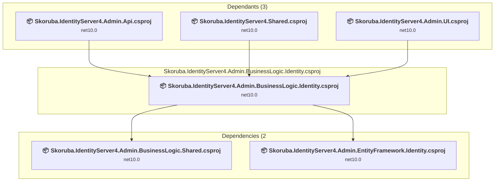

### API Compatibility

| Category | Count | Impact |
| :--- | :---: | :--- |
| 🔴 Binary Incompatible | 0 | High - Require code changes |
| 🟡 Source Incompatible | 0 | Medium - Needs re-compilation and potential conflicting API error fixing |
| 🔵 Behavioral change | 0 | Low - Behavioral changes that may require testing at runtime |
| ✅ Compatible | 0 |  |
| ***Total APIs Analyzed*** | ***0*** |  |

<a id="srcskorubaidentityserver4adminbusinesslogicsharedskorubaidentityserver4adminbusinesslogicsharedcsproj"></a>
### src\Skoruba.IdentityServer4.Admin.BusinessLogic.Shared\Skoruba.IdentityServer4.Admin.BusinessLogic.Shared.csproj

#### Project Info

- **Current Target Framework:** net10.0✅
- **SDK-style**: True
- **Project Kind:** ClassLibrary
- **Dependencies**: 0
- **Dependants**: 2
- **Number of Files**: 6
- **Lines of Code**: 105
- **Estimated LOC to modify**: 0+ (at least 0,0% of the project)

#### Dependency Graph

Legend:
📦 SDK-style project
⚙️ Classic project

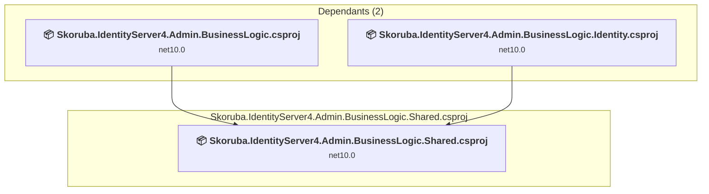

### API Compatibility

| Category | Count | Impact |
| :--- | :---: | :--- |
| 🔴 Binary Incompatible | 0 | High - Require code changes |
| 🟡 Source Incompatible | 0 | Medium - Needs re-compilation and potential conflicting API error fixing |
| 🔵 Behavioral change | 0 | Low - Behavioral changes that may require testing at runtime |
| ✅ Compatible | 0 |  |
| ***Total APIs Analyzed*** | ***0*** |  |

<a id="srcskorubaidentityserver4adminbusinesslogicskorubaidentityserver4adminbusinesslogiccsproj"></a>
### src\Skoruba.IdentityServer4.Admin.BusinessLogic\Skoruba.IdentityServer4.Admin.BusinessLogic.csproj

#### Project Info

- **Current Target Framework:** net10.0✅
- **SDK-style**: True
- **Project Kind:** ClassLibrary
- **Dependencies**: 2
- **Dependants**: 3
- **Number of Files**: 143
- **Lines of Code**: 5104
- **Estimated LOC to modify**: 0+ (at least 0,0% of the project)

#### Dependency Graph

Legend:
📦 SDK-style project
⚙️ Classic project

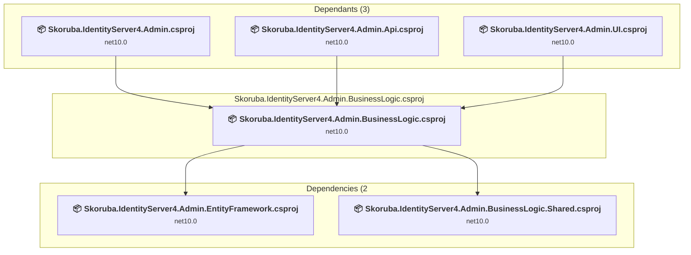

### API Compatibility

| Category | Count | Impact |
| :--- | :---: | :--- |
| 🔴 Binary Incompatible | 0 | High - Require code changes |
| 🟡 Source Incompatible | 0 | Medium - Needs re-compilation and potential conflicting API error fixing |
| 🔵 Behavioral change | 0 | Low - Behavioral changes that may require testing at runtime |
| ✅ Compatible | 0 |  |
| ***Total APIs Analyzed*** | ***0*** |  |

<a id="srcskorubaidentityserver4adminentityframeworkconfigurationskorubaidentityserver4adminentityframeworkconfigurationcsproj"></a>
### src\Skoruba.IdentityServer4.Admin.EntityFramework.Configuration\Skoruba.IdentityServer4.Admin.EntityFramework.Configuration.csproj

#### Project Info

- **Current Target Framework:** net10.0✅
- **SDK-style**: True
- **Project Kind:** ClassLibrary
- **Dependencies**: 1
- **Dependants**: 3
- **Number of Files**: 14
- **Lines of Code**: 458
- **Estimated LOC to modify**: 0+ (at least 0,0% of the project)

#### Dependency Graph

Legend:
📦 SDK-style project
⚙️ Classic project

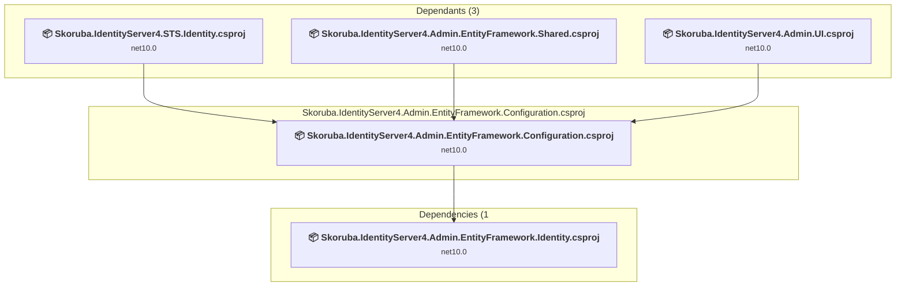

### API Compatibility

| Category | Count | Impact |
| :--- | :---: | :--- |
| 🔴 Binary Incompatible | 0 | High - Require code changes |
| 🟡 Source Incompatible | 0 | Medium - Needs re-compilation and potential conflicting API error fixing |
| 🔵 Behavioral change | 0 | Low - Behavioral changes that may require testing at runtime |
| ✅ Compatible | 0 |  |
| ***Total APIs Analyzed*** | ***0*** |  |

<a id="srcskorubaidentityserver4adminentityframeworkextensionsskorubaidentityserver4adminentityframeworkextensionscsproj"></a>
### src\Skoruba.IdentityServer4.Admin.EntityFramework.Extensions\Skoruba.IdentityServer4.Admin.EntityFramework.Extensions.csproj

#### Project Info

- **Current Target Framework:** net10.0✅
- **SDK-style**: True
- **Project Kind:** ClassLibrary
- **Dependencies**: 0
- **Dependants**: 1
- **Number of Files**: 5
- **Lines of Code**: 113
- **Estimated LOC to modify**: 0+ (at least 0,0% of the project)

#### Dependency Graph

Legend:
📦 SDK-style project
⚙️ Classic project

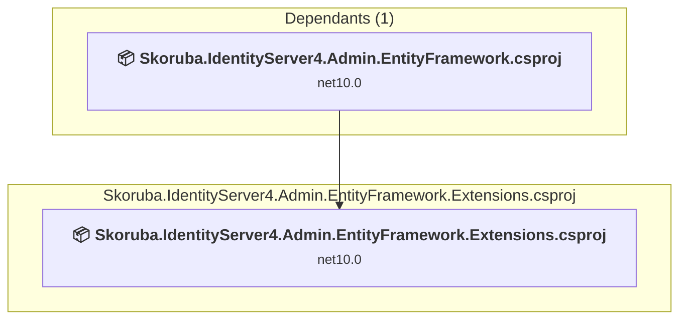

### API Compatibility

| Category | Count | Impact |
| :--- | :---: | :--- |
| 🔴 Binary Incompatible | 0 | High - Require code changes |
| 🟡 Source Incompatible | 0 | Medium - Needs re-compilation and potential conflicting API error fixing |
| 🔵 Behavioral change | 0 | Low - Behavioral changes that may require testing at runtime |
| ✅ Compatible | 0 |  |
| ***Total APIs Analyzed*** | ***0*** |  |

<a id="srcskorubaidentityserver4adminentityframeworkidentityskorubaidentityserver4adminentityframeworkidentitycsproj"></a>
### src\Skoruba.IdentityServer4.Admin.EntityFramework.Identity\Skoruba.IdentityServer4.Admin.EntityFramework.Identity.csproj

#### Project Info

- **Current Target Framework:** net10.0✅
- **SDK-style**: True
- **Project Kind:** ClassLibrary
- **Dependencies**: 1
- **Dependants**: 2
- **Number of Files**: 4
- **Lines of Code**: 657
- **Estimated LOC to modify**: 0+ (at least 0,0% of the project)

#### Dependency Graph

Legend:
📦 SDK-style project
⚙️ Classic project

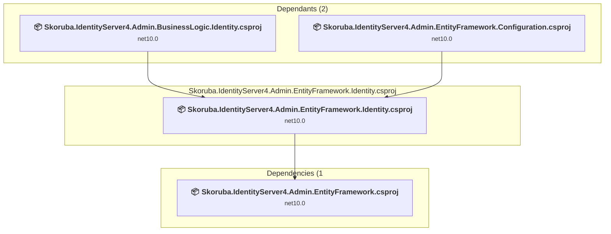

### API Compatibility

| Category | Count | Impact |
| :--- | :---: | :--- |
| 🔴 Binary Incompatible | 0 | High - Require code changes |
| 🟡 Source Incompatible | 0 | Medium - Needs re-compilation and potential conflicting API error fixing |
| 🔵 Behavioral change | 0 | Low - Behavioral changes that may require testing at runtime |
| ✅ Compatible | 0 |  |
| ***Total APIs Analyzed*** | ***0*** |  |

<a id="srcskorubaidentityserver4adminentityframeworkmysqlskorubaidentityserver4adminentityframeworkmysqlcsproj"></a>
### src\Skoruba.IdentityServer4.Admin.EntityFramework.MySql\Skoruba.IdentityServer4.Admin.EntityFramework.MySql.csproj

#### Project Info

- **Current Target Framework:** net10.0✅
- **SDK-style**: True
- **Project Kind:** ClassLibrary
- **Dependencies**: 1
- **Dependants**: 2
- **Number of Files**: 25
- **Lines of Code**: 5533
- **Estimated LOC to modify**: 0+ (at least 0,0% of the project)

#### Dependency Graph

Legend:
📦 SDK-style project
⚙️ Classic project

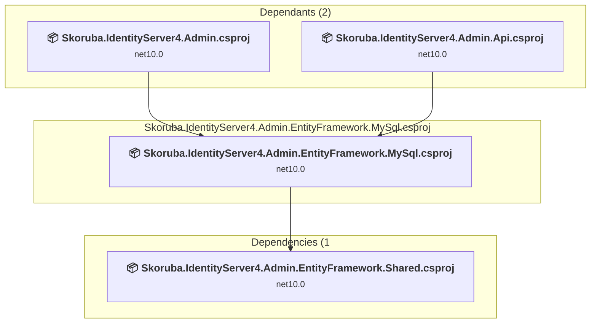

### API Compatibility

| Category | Count | Impact |
| :--- | :---: | :--- |
| 🔴 Binary Incompatible | 0 | High - Require code changes |
| 🟡 Source Incompatible | 0 | Medium - Needs re-compilation and potential conflicting API error fixing |
| 🔵 Behavioral change | 0 | Low - Behavioral changes that may require testing at runtime |
| ✅ Compatible | 0 |  |
| ***Total APIs Analyzed*** | ***0*** |  |

<a id="srcskorubaidentityserver4adminentityframeworkpostgresqlskorubaidentityserver4adminentityframeworkpostgresqlcsproj"></a>
### src\Skoruba.IdentityServer4.Admin.EntityFramework.PostgreSQL\Skoruba.IdentityServer4.Admin.EntityFramework.PostgreSQL.csproj

#### Project Info

- **Current Target Framework:** net10.0✅
- **SDK-style**: True
- **Project Kind:** ClassLibrary
- **Dependencies**: 1
- **Dependants**: 2
- **Number of Files**: 25
- **Lines of Code**: 5643
- **Estimated LOC to modify**: 0+ (at least 0,0% of the project)

#### Dependency Graph

Legend:
📦 SDK-style project
⚙️ Classic project

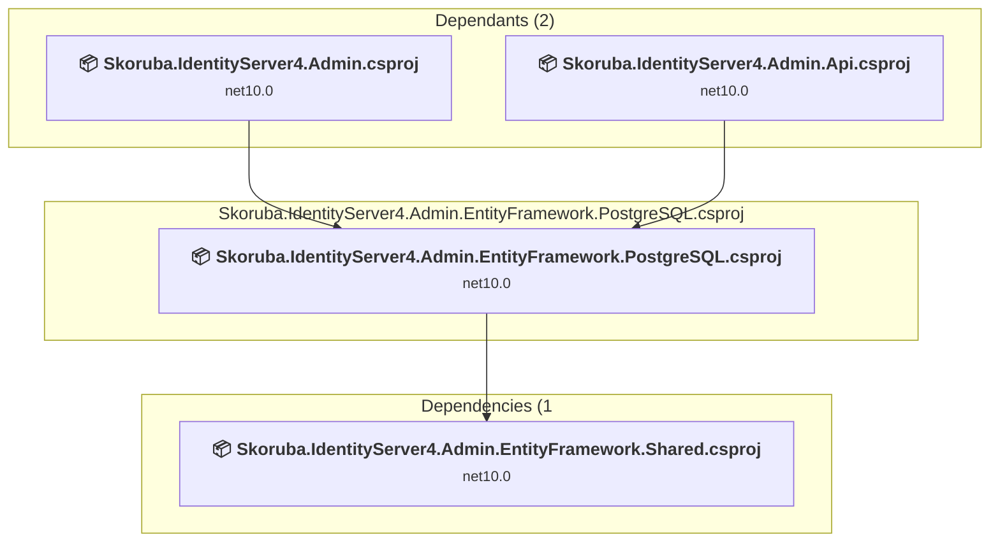

### API Compatibility

| Category | Count | Impact |
| :--- | :---: | :--- |
| 🔴 Binary Incompatible | 0 | High - Require code changes |
| 🟡 Source Incompatible | 0 | Medium - Needs re-compilation and potential conflicting API error fixing |
| 🔵 Behavioral change | 0 | Low - Behavioral changes that may require testing at runtime |
| ✅ Compatible | 0 |  |
| ***Total APIs Analyzed*** | ***0*** |  |

<a id="srcskorubaidentityserver4adminentityframeworksharedskorubaidentityserver4adminentityframeworksharedcsproj"></a>
### src\Skoruba.IdentityServer4.Admin.EntityFramework.Shared\Skoruba.IdentityServer4.Admin.EntityFramework.Shared.csproj

#### Project Info

- **Current Target Framework:** net10.0✅
- **SDK-style**: True
- **Project Kind:** ClassLibrary
- **Dependencies**: 1
- **Dependants**: 4
- **Number of Files**: 15
- **Lines of Code**: 628
- **Estimated LOC to modify**: 0+ (at least 0,0% of the project)

#### Dependency Graph

Legend:
📦 SDK-style project
⚙️ Classic project

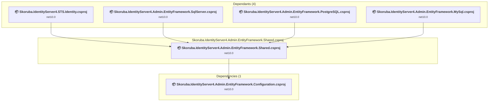

### API Compatibility

| Category | Count | Impact |
| :--- | :---: | :--- |
| 🔴 Binary Incompatible | 0 | High - Require code changes |
| 🟡 Source Incompatible | 0 | Medium - Needs re-compilation and potential conflicting API error fixing |
| 🔵 Behavioral change | 0 | Low - Behavioral changes that may require testing at runtime |
| ✅ Compatible | 0 |  |
| ***Total APIs Analyzed*** | ***0*** |  |

<a id="srcskorubaidentityserver4adminentityframeworksqlserverskorubaidentityserver4adminentityframeworksqlservercsproj"></a>
### src\Skoruba.IdentityServer4.Admin.EntityFramework.SqlServer\Skoruba.IdentityServer4.Admin.EntityFramework.SqlServer.csproj

#### Project Info

- **Current Target Framework:** net10.0✅
- **SDK-style**: True
- **Project Kind:** ClassLibrary
- **Dependencies**: 1
- **Dependants**: 2
- **Number of Files**: 25
- **Lines of Code**: 5670
- **Estimated LOC to modify**: 0+ (at least 0,0% of the project)

#### Dependency Graph

Legend:
📦 SDK-style project
⚙️ Classic project

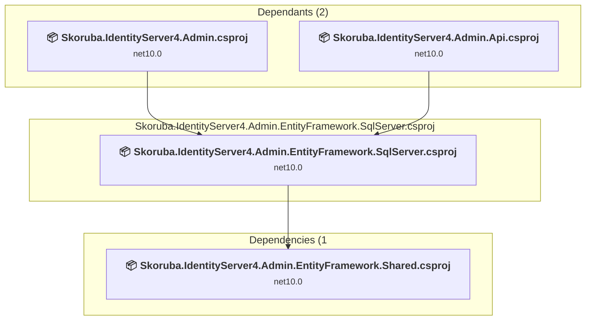

### API Compatibility

| Category | Count | Impact |
| :--- | :---: | :--- |
| 🔴 Binary Incompatible | 0 | High - Require code changes |
| 🟡 Source Incompatible | 0 | Medium - Needs re-compilation and potential conflicting API error fixing |
| 🔵 Behavioral change | 0 | Low - Behavioral changes that may require testing at runtime |
| ✅ Compatible | 0 |  |
| ***Total APIs Analyzed*** | ***0*** |  |

<a id="srcskorubaidentityserver4adminentityframeworkskorubaidentityserver4adminentityframeworkcsproj"></a>
### src\Skoruba.IdentityServer4.Admin.EntityFramework\Skoruba.IdentityServer4.Admin.EntityFramework.csproj

#### Project Info

- **Current Target Framework:** net10.0✅
- **SDK-style**: True
- **Project Kind:** ClassLibrary
- **Dependencies**: 1
- **Dependants**: 2
- **Number of Files**: 24
- **Lines of Code**: 1798
- **Estimated LOC to modify**: 0+ (at least 0,0% of the project)

#### Dependency Graph

Legend:
📦 SDK-style project
⚙️ Classic project

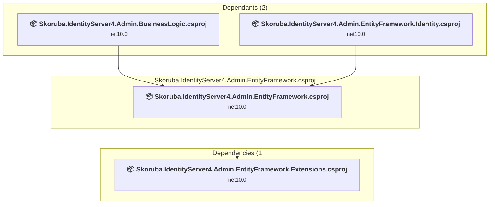

### API Compatibility

| Category | Count | Impact |
| :--- | :---: | :--- |
| 🔴 Binary Incompatible | 0 | High - Require code changes |
| 🟡 Source Incompatible | 0 | Medium - Needs re-compilation and potential conflicting API error fixing |
| 🔵 Behavioral change | 0 | Low - Behavioral changes that may require testing at runtime |
| ✅ Compatible | 0 |  |
| ***Total APIs Analyzed*** | ***0*** |  |

<a id="srcskorubaidentityserver4adminuiskorubaidentityserver4adminuicsproj"></a>
### src\Skoruba.IdentityServer4.Admin.UI\Skoruba.IdentityServer4.Admin.UI.csproj

#### Project Info

- **Current Target Framework:** net10.0✅
- **SDK-style**: True
- **Project Kind:** ClassLibrary
- **Dependencies**: 4
- **Dependants**: 1
- **Number of Files**: 1102
- **Lines of Code**: 9798
- **Estimated LOC to modify**: 0+ (at least 0,0% of the project)

#### Dependency Graph

Legend:
📦 SDK-style project
⚙️ Classic project

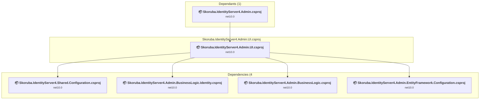

### API Compatibility

| Category | Count | Impact |
| :--- | :---: | :--- |
| 🔴 Binary Incompatible | 0 | High - Require code changes |
| 🟡 Source Incompatible | 0 | Medium - Needs re-compilation and potential conflicting API error fixing |
| 🔵 Behavioral change | 0 | Low - Behavioral changes that may require testing at runtime |
| ✅ Compatible | 0 |  |
| ***Total APIs Analyzed*** | ***0*** |  |

<a id="srcskorubaidentityserver4adminskorubaidentityserver4admincsproj"></a>
### src\Skoruba.IdentityServer4.Admin\Skoruba.IdentityServer4.Admin.csproj

#### Project Info

- **Current Target Framework:** net10.0✅
- **SDK-style**: True
- **Project Kind:** AspNetCore
- **Dependencies**: 6
- **Dependants**: 2
- **Number of Files**: 9
- **Lines of Code**: 306
- **Estimated LOC to modify**: 0+ (at least 0,0% of the project)

#### Dependency Graph

Legend:
📦 SDK-style project
⚙️ Classic project

```mermaid
flowchart TB
    subgraph upstream["Dependants (2)"]
        P2["<b>📦&nbsp;Skoruba.IdentityServer4.Admin.IntegrationTests.csproj</b><br/><small>net10.0</small>"]
        P3["<b>📦&nbsp;Skoruba.IdentityServer4.Admin.UnitTests.csproj</b><br/><small>net10.0</small>"]
        click P2 "#testsskorubaidentityserver4adminintegrationtestsskorubaidentityserver4adminintegrationtestscsproj"
        click P3 "#testsskorubaidentityserver4adminunittestsskorubaidentityserver4adminunittestscsproj"
    end
    subgraph current["Skoruba.IdentityServer4.Admin.csproj"]
        MAIN["<b>📦&nbsp;Skoruba.IdentityServer4.Admin.csproj</b><br/><small>net10.0</small>"]
        click MAIN "#srcskorubaidentityserver4adminskorubaidentityserver4admincsproj"
    end
    subgraph downstream["Dependencies (6"]
        P14["<b>📦&nbsp;Skoruba.IdentityServer4.Admin.EntityFramework.SqlServer.csproj</b><br/><small>net10.0</small>"]
        P19["<b>📦&nbsp;Skoruba.IdentityServer4.Admin.UI.csproj</b><br/><small>net10.0</small>"]
        P5["<b>📦&nbsp;Skoruba.IdentityServer4.Admin.BusinessLogic.csproj</b><br/><small>net10.0</small>"]
        P18["<b>📦&nbsp;Skoruba.IdentityServer4.Shared.csproj</b><br/><small>net10.0</small>"]
        P15["<b>📦&nbsp;Skoruba.IdentityServer4.Admin.EntityFramework.PostgreSQL.csproj</b><br/><small>net10.0</small>"]
        P16["<b>📦&nbsp;Skoruba.IdentityServer4.Admin.EntityFramework.MySql.csproj</b><br/><small>net10.0</small>"]
        click P14 "#srcskorubaidentityserver4adminentityframeworksqlserverskorubaidentityserver4adminentityframeworksqlservercsproj"
        click P19 "#srcskorubaidentityserver4adminuiskorubaidentityserver4adminuicsproj"
        click P5 "#srcskorubaidentityserver4adminbusinesslogicskorubaidentityserver4adminbusinesslogiccsproj"
        click P18 "#srcskorubaidentityserver4sharedskorubaidentityserver4sharedcsproj"
        click P15 "#srcskorubaidentityserver4adminentityframeworkpostgresqlskorubaidentityserver4adminentityframeworkpostgresqlcsproj"
        click P16 "#srcskorubaidentityserver4adminentityframeworkmysqlskorubaidentityserver4adminentityframeworkmysqlcsproj"
    end
    P2 --> MAIN
    P3 --> MAIN
    MAIN --> P14
    MAIN --> P19
    MAIN --> P5
    MAIN --> P18
    MAIN --> P15
    MAIN --> P16

```

### API Compatibility

| Category | Count | Impact |
| :--- | :---: | :--- |
| 🔴 Binary Incompatible | 0 | High - Require code changes |
| 🟡 Source Incompatible | 0 | Medium - Needs re-compilation and potential conflicting API error fixing |
| 🔵 Behavioral change | 0 | Low - Behavioral changes that may require testing at runtime |
| ✅ Compatible | 0 |  |
| ***Total APIs Analyzed*** | ***0*** |  |

<a id="srcskorubaidentityserver4sharedconfigurationskorubaidentityserver4sharedconfigurationcsproj"></a>
### src\Skoruba.IdentityServer4.Shared.Configuration\Skoruba.IdentityServer4.Shared.Configuration.csproj

#### Project Info

- **Current Target Framework:** net10.0✅
- **SDK-style**: True
- **Project Kind:** ClassLibrary
- **Dependencies**: 0
- **Dependants**: 3
- **Number of Files**: 19
- **Lines of Code**: 618
- **Estimated LOC to modify**: 0+ (at least 0,0% of the project)

#### Dependency Graph

Legend:
📦 SDK-style project
⚙️ Classic project

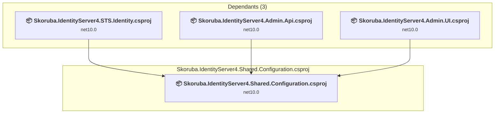

### API Compatibility

| Category | Count | Impact |
| :--- | :---: | :--- |
| 🔴 Binary Incompatible | 0 | High - Require code changes |
| 🟡 Source Incompatible | 0 | Medium - Needs re-compilation and potential conflicting API error fixing |
| 🔵 Behavioral change | 0 | Low - Behavioral changes that may require testing at runtime |
| ✅ Compatible | 0 |  |
| ***Total APIs Analyzed*** | ***0*** |  |

<a id="srcskorubaidentityserver4sharedskorubaidentityserver4sharedcsproj"></a>
### src\Skoruba.IdentityServer4.Shared\Skoruba.IdentityServer4.Shared.csproj

#### Project Info

- **Current Target Framework:** net10.0✅
- **SDK-style**: True
- **Project Kind:** ClassLibrary
- **Dependencies**: 1
- **Dependants**: 3
- **Number of Files**: 12
- **Lines of Code**: 108
- **Estimated LOC to modify**: 0+ (at least 0,0% of the project)

#### Dependency Graph

Legend:
📦 SDK-style project
⚙️ Classic project

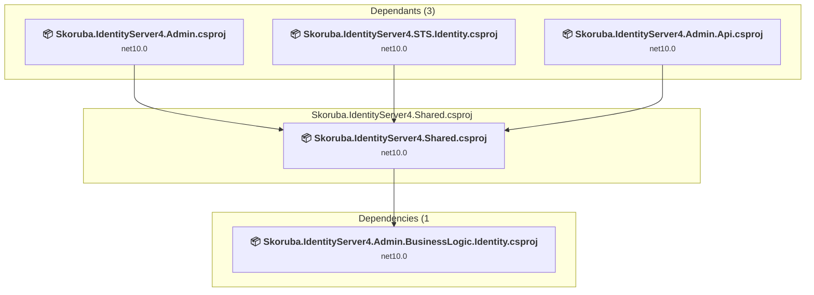

### API Compatibility

| Category | Count | Impact |
| :--- | :---: | :--- |
| 🔴 Binary Incompatible | 0 | High - Require code changes |
| 🟡 Source Incompatible | 0 | Medium - Needs re-compilation and potential conflicting API error fixing |
| 🔵 Behavioral change | 0 | Low - Behavioral changes that may require testing at runtime |
| ✅ Compatible | 0 |  |
| ***Total APIs Analyzed*** | ***0*** |  |

<a id="srcskorubaidentityserver4stsidentityskorubaidentityserver4stsidentitycsproj"></a>
### src\Skoruba.IdentityServer4.STS.Identity\Skoruba.IdentityServer4.STS.Identity.csproj

#### Project Info

- **Current Target Framework:** net10.0✅
- **SDK-style**: True
- **Project Kind:** AspNetCore
- **Dependencies**: 4
- **Dependants**: 1
- **Number of Files**: 731
- **Lines of Code**: 6618
- **Estimated LOC to modify**: 0+ (at least 0,0% of the project)

#### Dependency Graph

Legend:
📦 SDK-style project
⚙️ Classic project

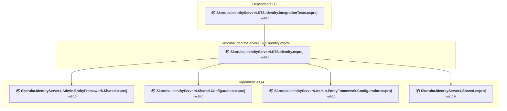

### API Compatibility

| Category | Count | Impact |
| :--- | :---: | :--- |
| 🔴 Binary Incompatible | 0 | High - Require code changes |
| 🟡 Source Incompatible | 0 | Medium - Needs re-compilation and potential conflicting API error fixing |
| 🔵 Behavioral change | 0 | Low - Behavioral changes that may require testing at runtime |
| ✅ Compatible | 0 |  |
| ***Total APIs Analyzed*** | ***0*** |  |

<a id="testsskorubaidentityserver4adminapiintegrationtestsskorubaidentityserver4adminapiintegrationtestscsproj"></a>
### tests\Skoruba.IdentityServer4.Admin.Api.IntegrationTests\Skoruba.IdentityServer4.Admin.Api.IntegrationTests.csproj

#### Project Info

- **Current Target Framework:** net10.0✅
- **SDK-style**: True
- **Project Kind:** DotNetCoreApp
- **Dependencies**: 1
- **Dependants**: 0
- **Number of Files**: 13
- **Lines of Code**: 353
- **Estimated LOC to modify**: 0+ (at least 0,0% of the project)

#### Dependency Graph

Legend:
📦 SDK-style project
⚙️ Classic project

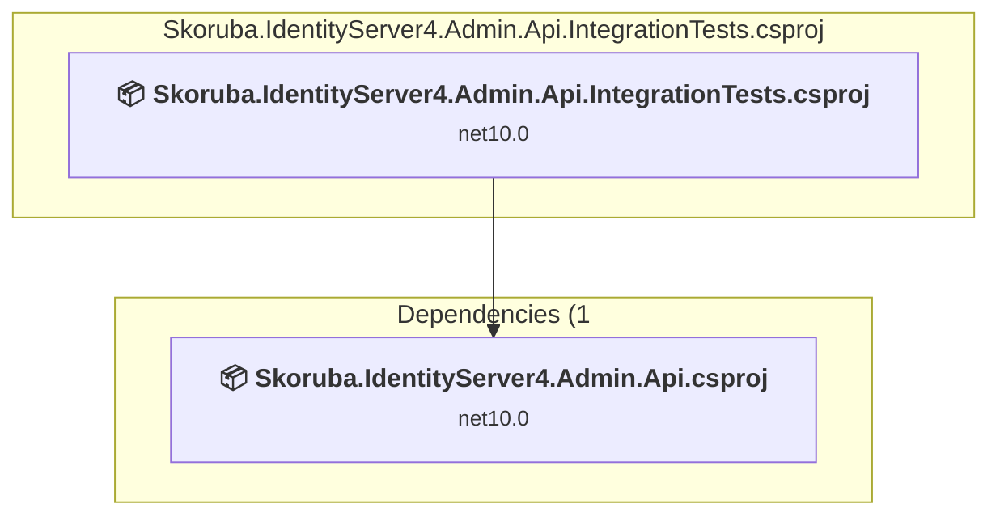

### API Compatibility

| Category | Count | Impact |
| :--- | :---: | :--- |
| 🔴 Binary Incompatible | 0 | High - Require code changes |
| 🟡 Source Incompatible | 0 | Medium - Needs re-compilation and potential conflicting API error fixing |
| 🔵 Behavioral change | 0 | Low - Behavioral changes that may require testing at runtime |
| ✅ Compatible | 0 |  |
| ***Total APIs Analyzed*** | ***0*** |  |

<a id="testsskorubaidentityserver4adminintegrationtestsskorubaidentityserver4adminintegrationtestscsproj"></a>
### tests\Skoruba.IdentityServer4.Admin.IntegrationTests\Skoruba.IdentityServer4.Admin.IntegrationTests.csproj

#### Project Info

- **Current Target Framework:** net10.0✅
- **SDK-style**: True
- **Project Kind:** DotNetCoreApp
- **Dependencies**: 1
- **Dependants**: 0
- **Number of Files**: 14
- **Lines of Code**: 518
- **Estimated LOC to modify**: 0+ (at least 0,0% of the project)

#### Dependency Graph

Legend:
📦 SDK-style project
⚙️ Classic project

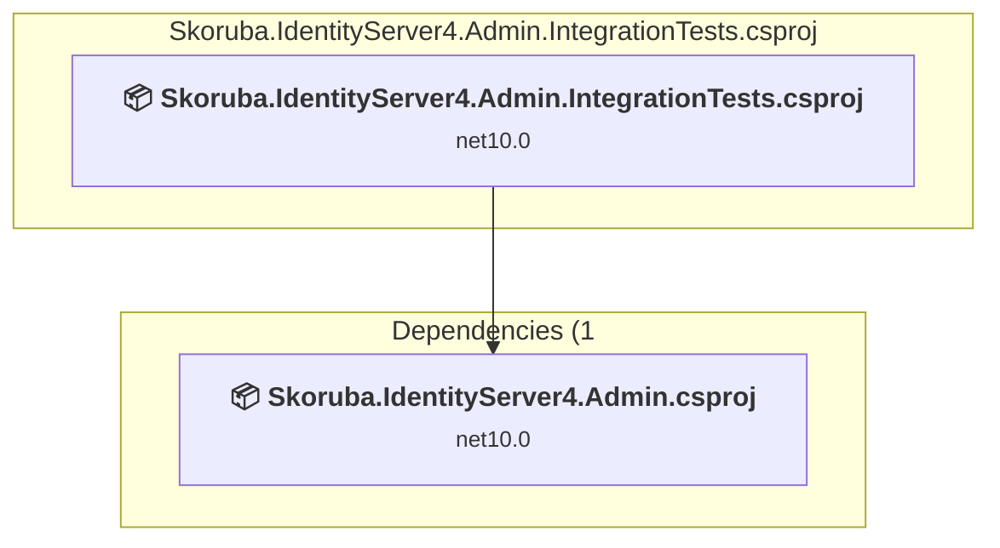

### API Compatibility

| Category | Count | Impact |
| :--- | :---: | :--- |
| 🔴 Binary Incompatible | 0 | High - Require code changes |
| 🟡 Source Incompatible | 0 | Medium - Needs re-compilation and potential conflicting API error fixing |
| 🔵 Behavioral change | 0 | Low - Behavioral changes that may require testing at runtime |
| ✅ Compatible | 0 |  |
| ***Total APIs Analyzed*** | ***0*** |  |

<a id="testsskorubaidentityserver4adminunittestsskorubaidentityserver4adminunittestscsproj"></a>
### tests\Skoruba.IdentityServer4.Admin.UnitTests\Skoruba.IdentityServer4.Admin.UnitTests.csproj

#### Project Info

- **Current Target Framework:** net10.0✅
- **SDK-style**: True
- **Project Kind:** DotNetCoreApp
- **Dependencies**: 1
- **Dependants**: 0
- **Number of Files**: 39
- **Lines of Code**: 8013
- **Estimated LOC to modify**: 0+ (at least 0,0% of the project)

#### Dependency Graph

Legend:
📦 SDK-style project
⚙️ Classic project

```mermaid
flowchart TB
    subgraph current["Skoruba.IdentityServer4.Admin.UnitTests.csproj"]
        MAIN["<b>📦&nbsp;Skoruba.IdentityServer4.Admin.UnitTests.csproj</b><br/><small>net10.0</small>"]
        click MAIN "#testsskorubaidentityserver4adminunittestsskorubaidentityserver4adminunittestscsproj"
    end
    subgraph downstream["Dependencies (1"]
        P1["<b>📦&nbsp;Skoruba.IdentityServer4.Admin.csproj</b><br/><small>net10.0</small>"]
        click P1 "#srcskorubaidentityserver4adminskorubaidentityserver4admincsproj"
    end
    MAIN --> P1

```

### API Compatibility

| Category | Count | Impact |
| :--- | :---: | :--- |
| 🔴 Binary Incompatible | 0 | High - Require code changes |
| 🟡 Source Incompatible | 0 | Medium - Needs re-compilation and potential conflicting API error fixing |
| 🔵 Behavioral change | 0 | Low - Behavioral changes that may require testing at runtime |
| ✅ Compatible | 0 |  |
| ***Total APIs Analyzed*** | ***0*** |  |

<a id="testsskorubaidentityserver4stsidentityintegrationtestsskorubaidentityserver4stsidentityintegrationtestscsproj"></a>
### tests\Skoruba.IdentityServer4.STS.Identity.IntegrationTests\Skoruba.IdentityServer4.STS.Identity.IntegrationTests.csproj

#### Project Info

- **Current Target Framework:** net10.0✅
- **SDK-style**: True
- **Project Kind:** DotNetCoreApp
- **Dependencies**: 1
- **Dependants**: 0
- **Number of Files**: 17
- **Lines of Code**: 738
- **Estimated LOC to modify**: 0+ (at least 0,0% of the project)

#### Dependency Graph

Legend:
📦 SDK-style project
⚙️ Classic project

```mermaid
flowchart TB
    subgraph current["Skoruba.IdentityServer4.STS.Identity.IntegrationTests.csproj"]
        MAIN["<b>📦&nbsp;Skoruba.IdentityServer4.STS.Identity.IntegrationTests.csproj</b><br/><small>net10.0</small>"]
        click MAIN "#testsskorubaidentityserver4stsidentityintegrationtestsskorubaidentityserver4stsidentityintegrationtestscsproj"
    end
    subgraph downstream["Dependencies (1"]
        P6["<b>📦&nbsp;Skoruba.IdentityServer4.STS.Identity.csproj</b><br/><small>net10.0</small>"]
        click P6 "#srcskorubaidentityserver4stsidentityskorubaidentityserver4stsidentitycsproj"
    end
    MAIN --> P6

```

### API Compatibility

| Category | Count | Impact |
| :--- | :---: | :--- |
| 🔴 Binary Incompatible | 0 | High - Require code changes |
| 🟡 Source Incompatible | 0 | Medium - Needs re-compilation and potential conflicting API error fixing |
| 🔵 Behavioral change | 0 | Low - Behavioral changes that may require testing at runtime |
| ✅ Compatible | 0 |  |
| ***Total APIs Analyzed*** | ***0*** |  |

